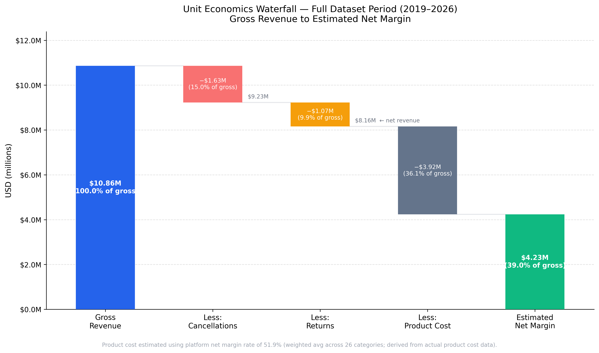
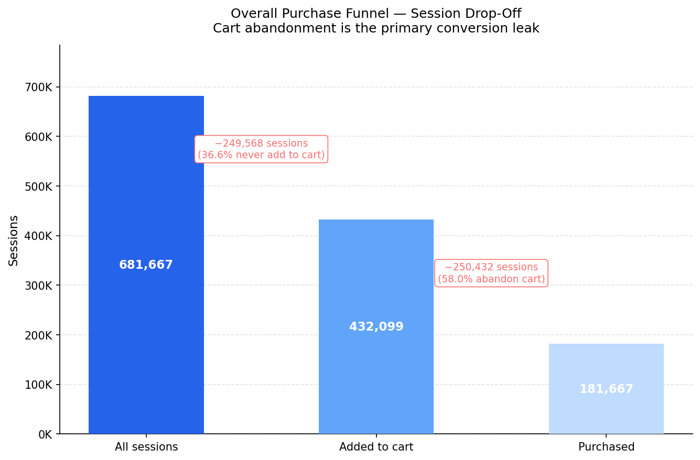
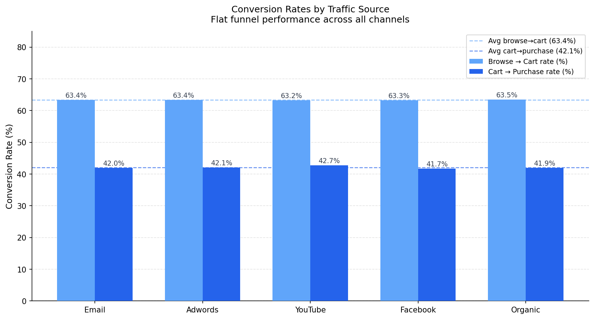
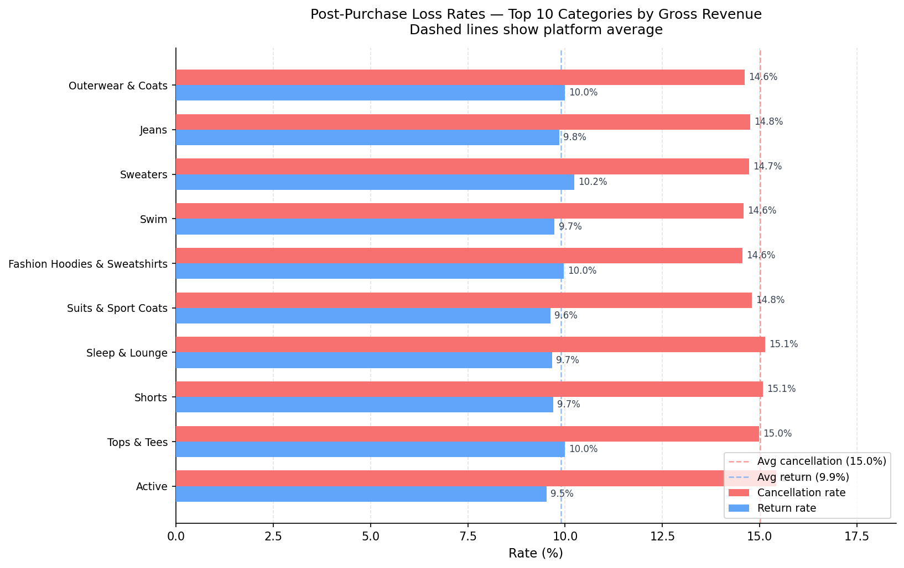
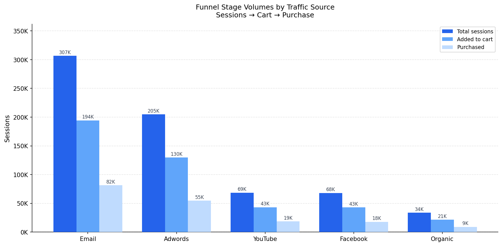
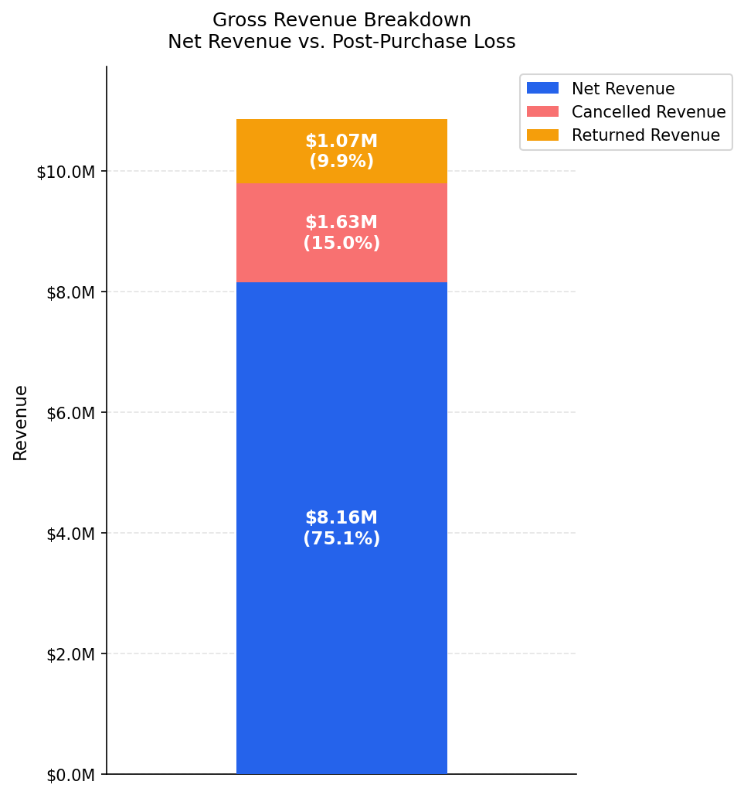
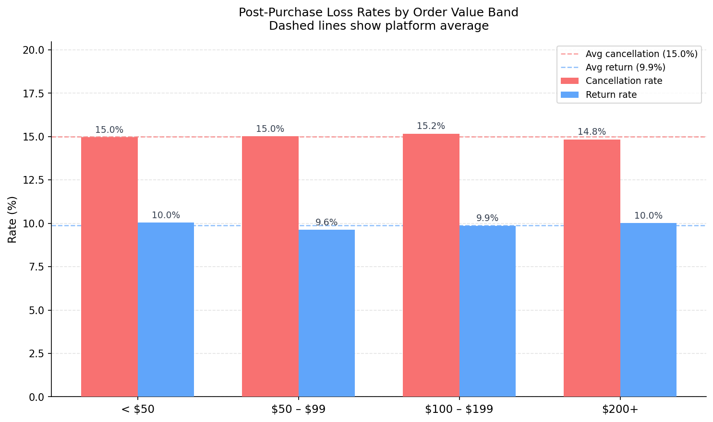

# E-Commerce Growth Analytics

**An end-to-end analytics case study identifying where an e-commerce business leaks growth, and where it does not.**

Dataset: [theLook eCommerce](https://console.cloud.google.com/marketplace/product/bigquery-public-data/thelook-ecommerce) (Google BigQuery public dataset, 125,408 orders, 100,000 users, 29,120 products).

> **Dataset note:** theLook eCommerce is a synthetic dataset. Revenue figures and trends reflect how the dataset was constructed, not observed real-world business performance. The accelerating revenue growth visible in 2025–2026 is a property of the synthetic data. All impact estimates in this project are illustrative scenario models based on historical dataset rates, not business forecasts.

---

## 1. Executive Summary

This project investigates five growth leakage areas (acquisition, conversion, retention, product mix, and fulfillment) to build a complete analytical picture from raw data to prioritized experiments.

**The primary finding is a single, high-confidence lever:** 58% of sessions that add to cart never complete a purchase. This abandonment rate is structurally flat across every traffic channel, every product category, and every customer segment, which means a platform-wide intervention (cart abandonment recovery) has broad reach and no competing explanations to untangle first.

**The secondary finding is what was ruled out.** The analysis tested traffic source, post-purchase loss patterns, category-level retention, and margin mix as potential growth drivers. All of them came back flat. That result matters: it means the business does not have a portfolio of targeted segment fixes to run. It has one clear platform-wide conversion problem to solve first, and one retention problem to address second.

**The third finding requires instrumentation before action.** The 15% cancellation rate represents ~$1.63M in lost gross revenue, but the root cause is unknown. No category, order value band, customer type, or distribution center shows elevated rates. The right move is to capture cancellation reasons before designing any intervention.

---

## 2. Key Recommendations

| Priority | Experiment | Lever | Annualized Upside | Why Now |
|---|---|---|---|---|
| 1st | Cart abandonment recovery email A/B test | Conversion | ~$14K/yr | Highest-confidence lever; email infrastructure likely in place; no segment complexity |
| 2nd | One-time buyer reactivation campaign | Retention | ~$10K/yr | 62.3% of buyers never return; well-established email playbook; can run in parallel with EXP-001 |
| 3rd | Cancellation reason capture (instrumentation only) | Post-purchase | ~$8K/yr (Phase B) | Root cause unknown; Phase A adds one form field and fills the biggest data gap in the analysis |
| 4th | High-margin category merchandising test | Product mix | ~$456/yr | Weakest margin lever; primary value is learning whether demand is category-transferable at all |

All upside estimates are annualized figures derived by dividing cumulative dataset-period impact by 7.4 years. They represent what a given rate improvement would have been worth across this dataset, not predictions of future business performance.

---

## 3. Project Status

| Workstream | Status | Assets | Key Finding |
|---|---|---|---|
| Data workflow | Complete | 7 processed tables; local DuckDB pipeline | No repeated cloud queries; all analysis runs locally against `data/processed/` |
| Core business metrics | Complete | 5 charts | ~25% combined order loss rate (cancel + return); 37.7% repeat buyer rate |
| Product / customer value | Complete | 4 charts | Jeans is the largest margin leak; Blazers & Jackets is highest-margin and underscaled |
| Funnel analysis | Complete | 3 charts | 26.5% session-purchase rate flat across all 5 channels; 58% cart abandonment is the primary conversion leak |
| Post-purchase loss | Complete | 3 charts | 15% cancel rate, 10% return rate, flat across all 26 categories, order value bands, customer types, and all 10 DCs |
| Margin mix scenarios | Complete | Growth lever scorecard; 4 CSVs | Cart-to-purchase is the highest-upside lever (~$68K/yr for +5pp); margin mix shift has limited upside (~$5K/yr for a 10% shift) |
| A/B test design | Complete | 3 experiment CSVs | 4 experiment designs with hypotheses, metrics, guardrails, upside estimates, and risk caveats |
| Unit economics waterfall | Complete | 1 chart | $10.86M gross to $4.23M estimated net margin (39% of gross) |
| Final review / defense | Complete | . | Credibility fixes applied; project ready for portfolio sharing |

---

## 4. Business Question

> *"Where is this e-commerce business leaking growth: acquisition, conversion, retention, product mix, or fulfillment?"*

The starting hypothesis: the business loses more growth through conversion quality, repeat purchasing, and post-purchase experience than through raw acquisition volume.

That hypothesis held up, but the more interesting result is the shape of the answer. The leaks are not spread across many segments and categories where targeted fixes could be applied. They are concentrated in one platform-wide conversion gap and one platform-wide retention problem, both of which resist segmentation-based solutions. That changes what the right interventions look like.

---

## 5. What I Found

### The unit economics picture

Of $10.86M in gross revenue over the dataset period, only $4.23M reaches estimated net margin after post-purchase losses and product cost. Cancellations and returns alone consume nearly $2.7M (25% of gross), and the combined loss rate has been structurally stable over time with no sign of improvement or worsening.



*Product cost estimated using the platform blended margin rate of 51.9%, a weighted average derived from actual product cost data across all 26 categories.*

---

### The primary growth lever: cart abandonment

Of 681,667 total sessions, 432,099 (63%) added to cart. Of those, only 181,667 (42%) completed a purchase; 250,432 cart sessions ended without one.



The critical structural observation: this 58% abandonment rate is flat across all five traffic channels. There is no channel driving it, no segment to exclude, no high-abandonment source to deprioritize. A platform-wide email intervention has a clean, well-scoped target.

> **Funnel data caveat:** Every session in this dataset contains at least one product-page view event. The browse-to-cart rate (63%) measures conversion among sessions that already reached a product page, not true top-of-funnel drop-off. The cart-to-purchase rate (42%) is unaffected by this limitation.

---

### The secondary lever: one-time buyer recovery

Only 37.7% of customers ever make a second purchase. The other 62.3% (roughly 50,000 buyers) purchase once and never return.


This is a platform retention problem, not a category problem. The repeat buyer rate is flat across all 26 product categories (36–39%), which means category mix does not explain the drop-off and category-targeted re-engagement campaigns have no structural advantage over a platform-wide approach.


---

### What was ruled out

Several growth hypotheses were tested and did not hold up. These negative results have real analytical value: they narrow the action space significantly.

**Traffic source does not explain funnel underperformance.** Session purchase rate is 26.4–27.0% across Email, Adwords, YouTube, Facebook, and Organic. Browse-to-cart and cart-to-purchase rates are equally flat. There is no channel-specific conversion problem to fix by reallocating spend or changing channel mix.



**Post-purchase loss cannot be targeted by category, order value, customer type, or fulfillment center.** The 15% cancellation rate and 9.9% return rate are nearly identical across all 26 categories (cancel range: 13.8–15.9%; return range: 8.1–11.3%), all four order value bands, new vs. repeat customers, and all 10 distribution centers. Delivery timing is uniform across DCs (~0.5 days to ship, 2.5 days to deliver). There is no segment to target. This requires root-cause investigation.



**Margin mix shift has limited upside.** The gap between the highest- and lowest-margin categories is real but modest. Shifting 10% of low-margin revenue to high-margin categories yields approximately ~$5K/yr annualized. Fashion demand is category-sticky; customers who shop Jeans do not reliably convert to Blazers & Jackets when shown them. The merchandising experiment (EXP-003) is best understood as a demand-elasticity learning test, not a margin program.

---

## 6. Evidence by Workstream

### Core Business Metrics

Revenue has grown consistently since 2019. The gross-to-net gap (cancelled + returned orders) is stable at ~25%, indicating a structural problem rather than a worsening one.


Outerwear & Coats, Jeans, and Sweaters are the three largest revenue drivers. Jeans (#2 in revenue) carries a 5+ percentage point margin penalty relative to the platform average, making it the single largest margin leak in the catalog.


Blazers & Jackets (62%), Accessories (60%), and Skirts (60%) are the most margin-efficient categories, but all three are significantly underscaled relative to their margins.


~10% of orders are returned and ~15% are cancelled. "Shipped" and "Processing" represent in-flight orders at the time of the dataset snapshot.


---

### Product / Customer Value

Each bubble below is a product category, sized by number of buyers and colored by strategic role (blue = Revenue leader, amber = Low-margin volume, green = Margin leader, purple = High-value acquisition).


High-ticket categories like Outerwear & Coats are heavily front-loaded: approximately 80% of lifetime margin comes from the first purchase. Post-first durability is limited for most high-LTV categories.


Of 26 categories, 8 are Revenue leaders, 7 are Low-margin volume categories, and the remainder are Margin leaders, High-value acquisition, or Niche categories.


---

### Funnel Analysis

Email is the largest traffic source by session volume. All five channels show a nearly identical funnel shape; conversion rates are the same regardless of source.



---

### Post-Purchase Loss

$1.63M (15.0%) was lost to cancellations and $1.07M (9.9%) to returns, a combined $2.7M post-purchase revenue loss on $10.86M gross revenue.



Loss rates are flat across all order value bands. High-value orders (> $200) cancel and return at the same rate as low-value orders (< $50).



---

### Growth Lever Scorecard

Five levers were quantified with two confidence dimensions: math confidence (how well the impact arithmetic is supported by the data) and execution confidence (how achievable the scenario is in practice).

| Lever | Scenario | Annualized Upside | Math Confidence | Execution Confidence |
|---|---|---|---|---|
| Cart-to-purchase +1pp | +1pp conversion rate | ~$14K/yr | High | Medium |
| Cart-to-purchase +5pp | +5pp conversion rate | ~$68K/yr | High | Low |
| Repeat orders +5% | +5% more repeat purchases | ~$10K/yr | Medium | Medium |
| Repeat orders +10% | +10% more repeat purchases | ~$21K/yr | Medium | Low |
| Cancellation rate −1pp | Recover 1pp of cancelled items | ~$8K/yr | High | Low |
| Return rate −1pp | Recover 1pp of returned items | ~$8K/yr | High | Low |
| Margin mix shift 10% | Shift 10% of demand to high-margin categories | ~$5K/yr | Medium | Low |

All figures are cumulative 2019–2026 dataset impact divided by 7.4 years. Full scorecard with assumption notes is in `outputs/tables/growth_lever_scorecard.csv`.

---

## 7. Experiment Recommendations

Four experiment designs are grounded in the scorecard above. Each includes a hypothesis, target segment, control/treatment definition, primary metric, guardrail metrics, upside estimate, and risk caveats.

| ID | Experiment | Lever | Annualized Upside | Launch Order |
|---|---|---|---|---|
| EXP-001 | Cart abandonment recovery email | Conversion | ~$14K/yr | 1st |
| EXP-002 | One-time buyer reactivation campaign | Retention | ~$10K/yr | 2nd (parallel with EXP-001) |
| EXP-004 | Cancellation reason capture (Phase A instrumentation) | Post-purchase | ~$8K/yr (Phase B) | 3rd |
| EXP-003 | High-margin category merchandising test | Product mix | ~$456/yr | 4th |

**EXP-001** targets the 250,000+ non-converting cart sessions per dataset period. Treatment is a single timed cart-reminder email (no discount in v1; test the reminder effect before layering incentives). Primary metric: cart-to-purchase rate, 7-day window.

**EXP-002** targets customers with exactly one lifetime purchase, 30+ days ago. Treatment is a two-touch email sequence with category-personalized recommendations based on first purchase. Primary metric: repeat order rate, 90-day window.

**EXP-001 and EXP-002 can run in parallel.** Both use email infrastructure and measure independent outcomes.

**EXP-004 is instrumentation-first.** The cancellation rate is flat across all segments, meaning the root cause is structurally unknown in this dataset. Phase A adds a required reason-selection step to the cancellation flow (4-week run). Phase B (designing an actual intervention) cannot begin until Phase A reason data is available. Do not design the intervention before the evidence exists.

**EXP-003 has the lowest expected ROI (~$456/yr for a 1% mix shift)** but answers a fundamental question: is fashion demand transferable across categories at all? That learning has value independent of the margin outcome. Do not run this experiment expecting material margin improvement.

Full designs with primary metrics and 9 guardrail metrics: `outputs/tables/experiment_designs.csv` and `outputs/tables/experiment_metric_definitions.csv`.

---

## 8. Technical Workflow

| Tool | Role |
|------|------|
| BigQuery | Raw data source (one-time export only) |
| Python + DuckDB | Local SQL analysis against downloaded CSVs |
| pandas + matplotlib | Data wrangling and visualization |
| GitHub | Version control and portfolio presentation |

Raw tables are downloaded once from BigQuery into `data/` (git-ignored) and queried locally via DuckDB. No repeated cloud queries are needed after the initial download; all analysis scripts run against `data/processed/`.

See [`reports/metric_definitions.md`](reports/metric_definitions.md) for definitions of all computed metrics and the revenue conventions (gross vs. net, estimated margin) used across analyses.

---

## 9. Reproducing This Project

**Prerequisites:** Python 3.10+, a Google Cloud project with BigQuery access to `bigquery-public-data.thelook_ecommerce`.

```bash
# 1. Install dependencies
pip install -r requirements.txt

# 2. Download the 7 raw tables from BigQuery into data/raw/
#    Tables: orders, order_items, users, products, events,
#            inventory_items, distribution_centers
#    Export each as CSV from the BigQuery console or bq CLI.

# 3. Clean encoding and validate
python src/clean_raw_csv_encoding.py
python src/validate_raw_data.py

# 4. Core business metric CSVs
#    Run sql/02_core_business_metrics.sql in BigQuery and download
#    the 5 result CSVs into outputs/tables/:
#      overall_business_summary.csv, monthly_business_metrics.csv,
#      category_business_metrics.csv, customer_purchase_summary.csv,
#      order_status_rates.csv
#    Column names must match those defined in sql/02_core_business_metrics.sql exactly;
#    BigQuery exports may need to be renamed if headers are auto-formatted on download.
python src/create_core_metric_charts.py

# 5. Product / customer value analysis
python src/build_product_value_analysis.py
python src/create_product_value_charts.py

# 6. Funnel analysis
python src/build_funnel_analysis.py
python src/create_funnel_charts.py

# 7. Post-purchase loss analysis
python src/build_post_purchase_analysis.py
python src/create_post_purchase_charts.py

# 8. Margin mix scenarios and growth lever scorecard
#    (requires outputs from steps 5, 6, 7)
python src/build_margin_mix_scenarios.py

# 9. A/B experiment designs
#    (requires outputs from steps 5, 6, 7, 8)
python src/build_experiment_recommendations.py

# 10. Unit economics waterfall chart
#     (requires outputs from steps 7, 8)
python src/create_unit_economics_waterfall.py
```

All chart outputs write to `outputs/figures/`. All intermediate CSV outputs write to `outputs/tables/` (git-ignored; local only).

---

## 10. Repository Structure

```
├── sql/                            # Reference SQL (BigQuery syntax)
│   └── 02_core_business_metrics.sql
├── src/                            # Python analysis and chart scripts
│   ├── clean_raw_csv_encoding.py       # Decode raw BigQuery CSVs to clean UTF-8
│   ├── validate_raw_data.py            # Validate processed files with DuckDB
│   ├── create_core_metric_charts.py    # Core business metric charts
│   ├── build_product_value_analysis.py # Product / customer value queries
│   ├── create_product_value_charts.py  # Product value charts
│   ├── build_funnel_analysis.py        # Funnel / conversion queries
│   ├── create_funnel_charts.py         # Funnel charts
│   ├── build_post_purchase_analysis.py # Post-purchase loss queries
│   ├── create_post_purchase_charts.py  # Post-purchase charts
│   ├── build_margin_mix_scenarios.py   # Margin mix scenarios + growth lever scorecard
│   ├── build_experiment_recommendations.py  # A/B experiment designs
│   └── create_unit_economics_waterfall.py   # Unit economics waterfall chart
├── outputs/
│   ├── tables/              # CSV outputs from each analysis (git-ignored; local only)
│   └── figures/             # PNG charts (committed)
├── reports/                 # Metric definitions and revenue conventions
│   └── metric_definitions.md
├── PROJECT_PLAN.md          # Full project scope and phase definitions
├── PROJECT_STATE.md         # Living handoff doc, current status and next steps
└── requirements.txt
```

> `data/` is git-ignored. Raw and processed CSVs live locally only. `outputs/tables/` is also git-ignored; only chart PNGs are committed.
