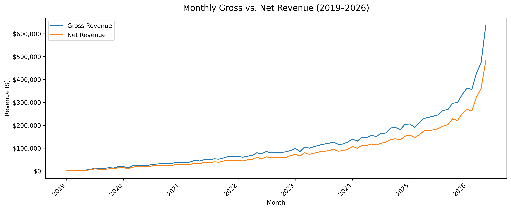
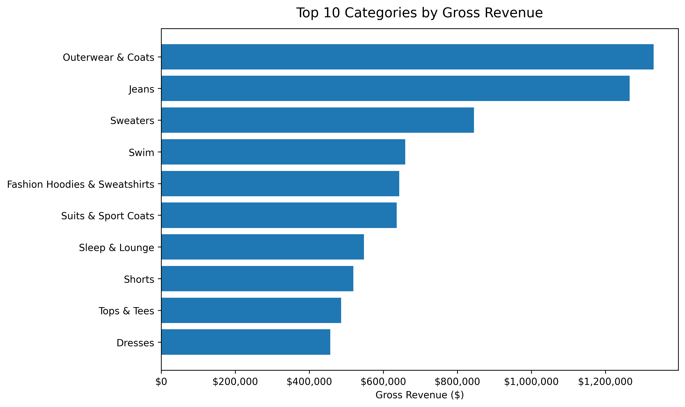
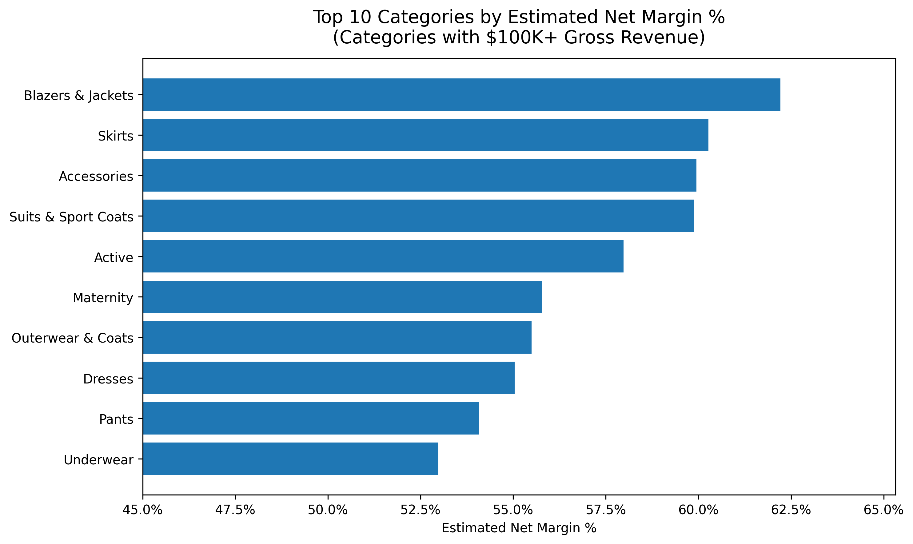
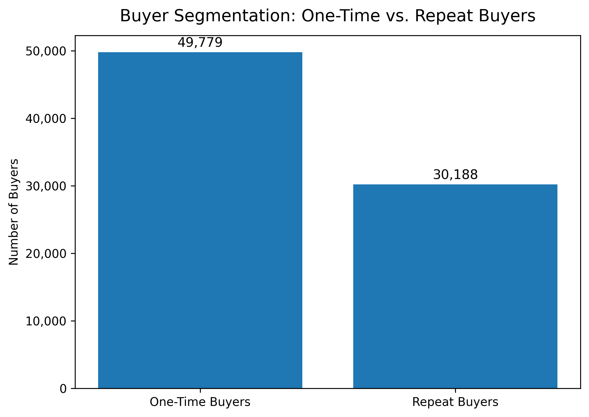
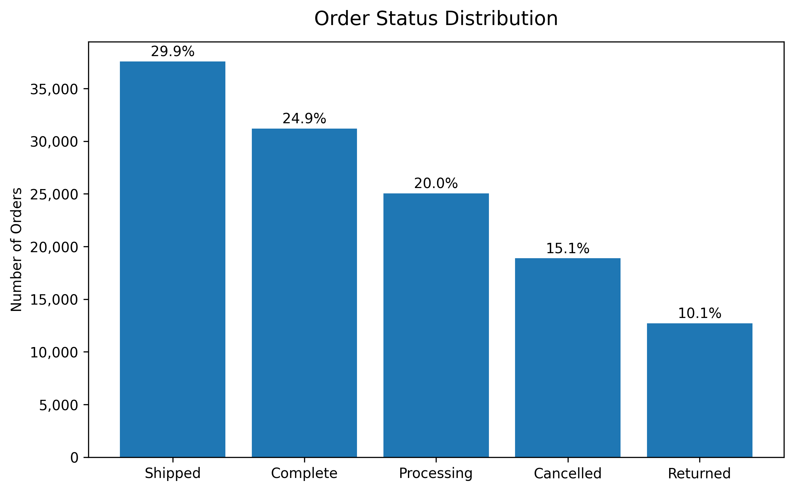
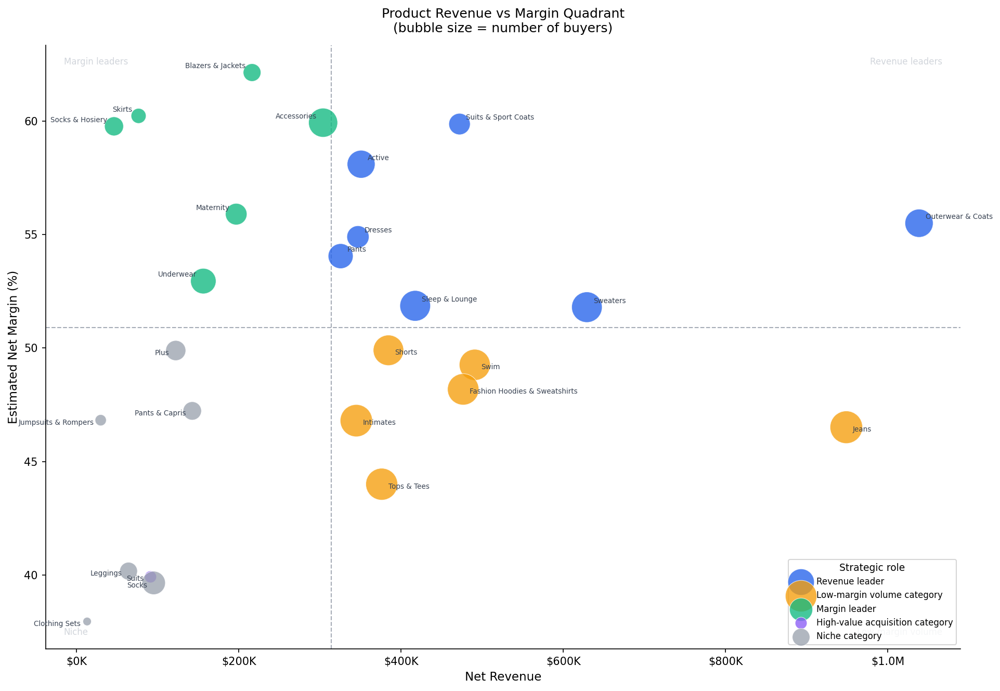
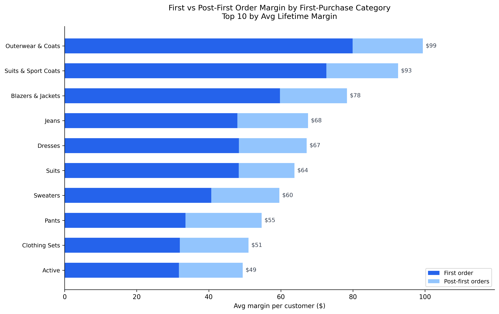
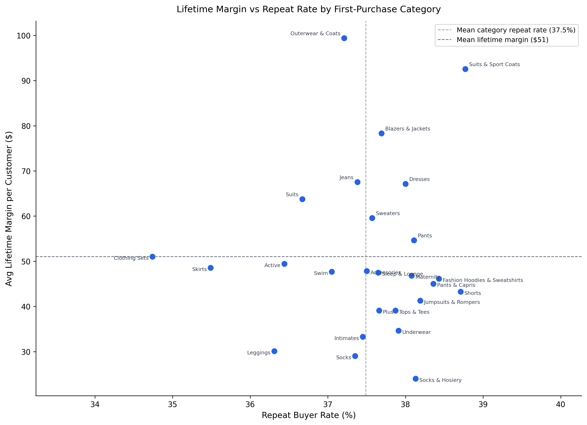
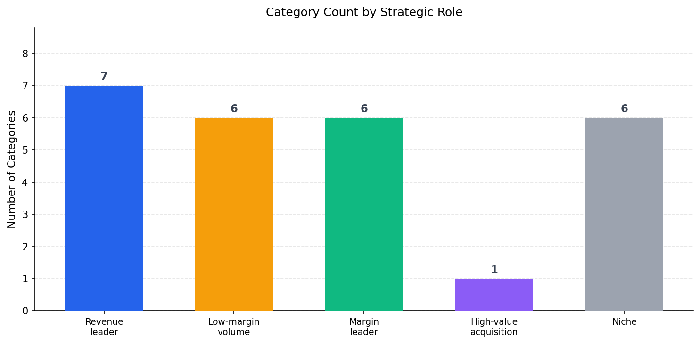

# E-Commerce Growth Analytics

**End-to-end analytics portfolio project identifying where an e-commerce business leaks growth — across product mix, customer value, acquisition, conversion, retention, and fulfillment.**

Dataset: [theLook eCommerce](https://console.cloud.google.com/marketplace/product/bigquery-public-data/thelook-ecommerce) (Google BigQuery public dataset) — 125,408 orders, 100,000 users, 29,120 products.

---

## Core Business Question

> *"Where is this e-commerce business leaking growth: acquisition, conversion, retention, product mix, or fulfillment?"*

---

## Project Status

| Workstream | Status | Assets | Key Finding / Next Step |
|---|---|---|---|
| Data workflow | Complete | 7 processed tables; local DuckDB pipeline | No repeated cloud queries; all analysis runs against `data/processed/` |
| Core business metrics | Complete | 5 charts | ~25% order loss rate (cancel + return); 37.7% repeat buyer rate |
| Product / customer value | Complete | 4 charts | Jeans is the largest margin leak; Blazers & Jackets is highest-margin and underscaled |
| Funnel analysis | Complete | 3 charts | ~26.5% session-purchase rate flat across all 5 channels; 58% cart abandonment is the primary conversion leak |
| Post-purchase loss | Complete | 3 charts | 15% cancel rate, 10% return rate — flat across all categories, order value bands, and customer types; structural platform problem |
| Margin mix scenarios | Complete | Growth lever scorecard; 4 CSVs | Cart-to-purchase conversion is the highest-upside lever (~$68K/yr annualized); pure margin mix shift has smaller upside than expected (~$4.6K/yr for a 10% shift) |
| A/B test design | Complete | 3 experiment CSVs | Cart abandonment recovery is top-priority; one-time buyer reactivation is second; cancellation work starts with reason-capture instrumentation |
| Tableau / dashboard | Not started | — | Visual portfolio layer |
| Final review / defense | Not started | — | Defender + critic + reconciliation passes before final polish |

---

## Tools & Workflow

| Tool | Role |
|------|------|
| BigQuery | Raw data source |
| Python + DuckDB | Local SQL analysis against downloaded CSVs |
| pandas + matplotlib | Data wrangling and visualization |
| GitHub | Version control and portfolio presentation |

Raw tables are downloaded once from BigQuery into `data/` (git-ignored) and queried locally via DuckDB — no repeated cloud queries needed.

---

## Analyses

### Phase 1 — Core Business Metrics

High-level health check across revenue, margin, category performance, and customer behavior.

**Monthly Gross vs Net Revenue**
Revenue has grown consistently since 2019. The gap between gross and net (cancelled + returned orders) is stable at ~25%, indicating a structural fulfillment issue rather than a growing one.



**Top Categories by Gross Revenue**
Outerwear & Coats, Jeans, and Sweaters are the three largest revenue drivers.



**Top Categories by Net Margin %**
Blazers & Jackets (62%), Accessories (60%), and Skirts (60%) are the most margin-efficient categories — but all three are significantly underscaled relative to their margins.



**Repeat vs One-Time Buyers**
Only 37.7% of customers make more than one purchase. The majority of revenue comes from one-time buyers, making acquisition costs difficult to recover.



**Order Status Distribution**
~10% of orders are returned and ~15% are cancelled — a combined ~25% loss rate that directly compresses net revenue and margin.



---

### Phase 2 — Product / Customer Value Analysis

Deep dive into which categories generate the most customer lifetime value, and whether that value is durable after the first order.

**Revenue vs Margin Quadrant**
Each bubble is a product category, sized by number of buyers, colored by strategic role. Revenue leaders (blue) sit top-right; Low-margin volume categories (amber) are high-revenue but margin-dilutive.



**First vs Post-First Order Margin**
The top 10 categories by lifetime margin, split into first-order margin (dark blue) and post-first-order margin (light blue). High-ticket categories like Outerwear & Coats are heavily front-loaded — ~80% of lifetime margin comes from the first purchase.



**Lifetime Margin vs Repeat Rate**
Repeat buyer rate is nearly flat across all 26 categories (36–39%). Category choice does not drive repeat behavior — retention is a platform-level problem, not a product mix problem.



**Category Count by Strategic Role**
Summary of how the 26 categories distribute across strategic roles based on revenue, margin, and LTV signals.



---

## Key Findings So Far

| Finding | Implication |
|---------|-------------|
| ~25% of orders cancelled or returned | Structural fulfillment or expectation-setting problem — compresses margin across all categories |
| 37.7% repeat buyer rate, flat across all categories | Retention is a platform issue, not a product mix issue — no category is "sticky" |
| Outerwear & Coats: $99 avg lifetime margin but 80% front-loaded | High-LTV acquisition target, but the business doesn't benefit much from repeat purchasing |
| Jeans: #2 in revenue ($949K) but 5+ points below average margin | Largest single margin leak in the catalog |
| Blazers & Jackets: highest margin % (62%) but underscaled | Scaling this category would improve the overall margin mix |
| Socks / Underwear: 61–74% of LTV comes post-first-order | Most durable categories, but absolute LTV is low ($24–35) |

---

## Repository Structure

```
├── sql/                     # Reference SQL (BigQuery syntax)
├── src/                     # Python scripts for analysis and charts
│   ├── clean_raw_csv_encoding.py
│   ├── validate_raw_data.py
│   ├── build_product_value_analysis.py
│   └── create_product_value_charts.py
├── outputs/
│   ├── tables/              # CSV outputs from each analysis
│   └── figures/             # PNG charts
├── reports/                 # Metric definitions and reference docs
├── PROJECT_PLAN.md          # Full project scope and phase definitions
├── PROJECT_STATE.md         # Living handoff doc — current status and next steps
└── requirements.txt
```

> `data/` is git-ignored. Raw and processed CSVs live locally only.

